# PubPub Site Dump Report

Generated on: 2025-04-09 13:52:39

Community: rrid

## Dumped Files

- [pub_types.json](./pub_types.json)
- [stages.json](./stages.json)

## Workflow Visualization

```mermaid
graph LR
    0aaad7f7-0860-4fa5-b692-2ba3096b9894["Review Completed"]
    0aaad7f7-0860-4fa5-b692-2ba3096b9894-->|"can move to"| 19c1f319-e8b8-4d63-b746-7645b2c996eb["Review Under Edit"]
    1885b74a-9c28-4d3c-ae82-a61fabda329e["Preprint Under Review"]
    1885b74a-9c28-4d3c-ae82-a61fabda329e-->|"can move to"| 3dc7d230-6421-4990-aa2b-ed65b9287ffa["Preprint Ready for Publication"]
    3dc7d230-6421-4990-aa2b-ed65b9287ffa["Preprint Ready for Publication"]
    3dc7d230-6421-4990-aa2b-ed65b9287ffa-->|"can move to"| 30c5c208-c85c-4355-b17f-74ac081a2b44["Preprint + Reviews Published"]
    bc114211-efe7-4b0a-96ce-1d3e0872a121["Preprint Unassigned"]
    bc114211-efe7-4b0a-96ce-1d3e0872a121-->|"can move to"| 9239890d-fbad-4ce9-8173-8c708e451b08["Preprint Assigned"]
    9239890d-fbad-4ce9-8173-8c708e451b08["Preprint Assigned"]
    9239890d-fbad-4ce9-8173-8c708e451b08-->|"can move to"| 1885b74a-9c28-4d3c-ae82-a61fabda329e["Preprint Under Review"]
    ef5c6b80-924f-4288-ae58-c4ca6f15ad81["Review QA Complete"]
    8195bcde-0a64-4711-8baa-0907efc573f0["Review Invitations Sent"]
    8195bcde-0a64-4711-8baa-0907efc573f0-->|"can move to"| b45d0e6d-3681-46f6-be8f-78dc0b3af99a["Review Accepted"]
    8195bcde-0a64-4711-8baa-0907efc573f0-->|"can move to"| 07204a4c-7b98-4a7e-b377-62912869c526["Review Declined"]
    8195bcde-0a64-4711-8baa-0907efc573f0-->|"can move to"| 7887dc40-e031-4154-b23f-52ddab597216["Review No Response"]
    b45d0e6d-3681-46f6-be8f-78dc0b3af99a["Review Accepted"]
    b45d0e6d-3681-46f6-be8f-78dc0b3af99a-->|"can move to"| 0aaad7f7-0860-4fa5-b692-2ba3096b9894["Review Completed"]
    07204a4c-7b98-4a7e-b377-62912869c526["Review Declined"]
    ae579d09-ed1c-42fa-85d1-6e2d5bb93744["Build Content\Preprint Initiation"]
    ae579d09-ed1c-42fa-85d1-6e2d5bb93744-->|"can move to"| bc114211-efe7-4b0a-96ce-1d3e0872a121["Preprint Unassigned"]
    7887dc40-e031-4154-b23f-52ddab597216["Review No Response"]
    19c1f319-e8b8-4d63-b746-7645b2c996eb["Review Under Edit"]
    19c1f319-e8b8-4d63-b746-7645b2c996eb-->|"can move to"| ef5c6b80-924f-4288-ae58-c4ca6f15ad81["Review QA Complete"]
    30c5c208-c85c-4355-b17f-74ac081a2b44["Preprint + Reviews Published"]
```

## Stage Statistics

| Stage | Pubs | Actions | Members |
|-------|------|----------|----------|
| Review Completed | 0 | 4 | 0 |
| Preprint Under Review | 0 | 3 | 0 |
| Preprint Ready for Publication | 0 | 1 | 0 |
| Preprint Unassigned | 0 | 1 | 0 |
| Preprint Assigned | 0 | 0 | 0 |
| Review QA Complete | 0 | 0 | 0 |
| Review Invitations Sent | 0 | 4 | 0 |
| Review Accepted | 0 | 2 | 0 |
| Review Declined | 0 | 0 | 0 |
| Build Content\Preprint Initiation | 0 | 0 | 0 |
| Review No Response | 0 | 0 | 0 |
| Review Under Edit | 0 | 2 | 0 |
| Preprint + Reviews Published | 0 | 0 | 0 |

## Site URLs

- [https://app.pubpub.org/c/rrid](https://app.pubpub.org/c/rrid)
- [https://app.pubpub.org/c/rrid/pubs](https://app.pubpub.org/c/rrid/pubs)
- [https://app.pubpub.org/c/rrid/stages](https://app.pubpub.org/c/rrid/stages)
- [https://app.pubpub.org/c/rrid/activity/actions](https://app.pubpub.org/c/rrid/activity/actions)
- [https://app.pubpub.org/c/rrid/stages/manage](https://app.pubpub.org/c/rrid/stages/manage)
- [https://app.pubpub.org/c/rrid/forms](https://app.pubpub.org/c/rrid/forms)
- [https://app.pubpub.org/c/rrid/types](https://app.pubpub.org/c/rrid/types)
- [https://app.pubpub.org/c/rrid/fields](https://app.pubpub.org/c/rrid/fields)
- [https://app.pubpub.org/c/rrid/members](https://app.pubpub.org/c/rrid/members)
- [https://app.pubpub.org/c/rrid/settings/tokens](https://app.pubpub.org/c/rrid/settings/tokens)
- [https://app.pubpub.org/c/rrid/developers/docs#/](https://app.pubpub.org/c/rrid/developers/docs#/)
